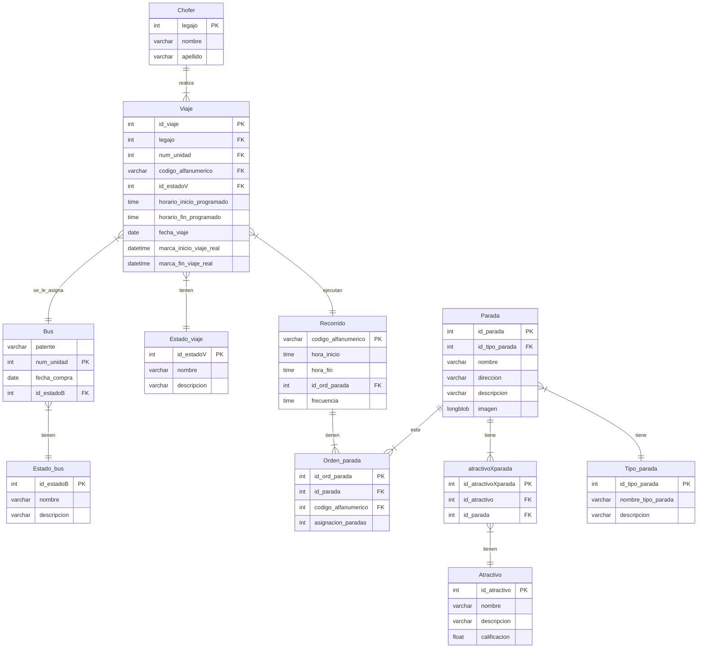

# TP Integrador BUSTURISTICO
Integrantes Grupo 2:
- Joaquín Chayle
- Juan Loza
- Benicio Manzotti
- Guido Morero
  
El trabajo práctico consiste en crear un proyecto django, en este caso, diseñado para un bus turistico de Buenos Aires. 

Estas deberian ser las funcionalidades que tendria que cumplir el proyecto (en proceso):
- visualizacion de recorridos, atractivos y paradas del lado del usuario
- creacion de viajes, reportes diarios del lado del administrador, ademas de poder llevar un registro de los colectivos habilitados y los choferes que esta activos
- carga de tiempo de viajes de los chofferes y generacion de tickets

Diagrama ER

