```mermaid

classDiagram

    class EstadoBus {
        +nombre: str
        +descripcion: str
        +__str__()
    }

    class EstadoViaje {
        +nombre: str
        +descripcion: str
        +__str__()
    }

    class Recorrido {
        +nombre: str
        +codigo_alfanumerico: str
        +hora_inicio: Time
        +hora_fin: Time
        +frecuencia: Time
        +__str__()
    }

    class Parada {
        +nombre: str
        +direccion: str
        +descripcion: str
        +imagen: bool
        +tipo_parada: tipo_parada
        +__str__()
    }

    class TipoParada {
        +nombre_tipo_parada: str
        +descripcion: str
        +__str__()
    }

    class Atractivo {
        +nombre: str
        +descripcion: str
        +calificacion: float
        +__str__()
    }

    class AtractivoXParada {
        +parada: parada
        +atractivo: atractivo
    }

    class OrdenParada {
        +parada: parada
        +recorrido: recorrido
        +asignacion_paradas: int
    }

    class Bus {
        +patente: str
        +num_unidad: int
        +fecha_compra: date
        +estado_bus: estad_bus
        +clean()
        +save()
        +__str__()
    }

    class Chofer {
        +legajo: int
        +nombre: str
        +apellido: str
        +__str__()
    }

    class Viaje {
        +chofer[]: listachoferes
        +bus[]: listabuses
        +recorrido[]: listarecorridos
        +estado_viaje: estado_viaje
        +horario_inicio_programado: time
        +horario_fin_programado: time
        +fecha_viaje: date
        +marca_inicio_viaje_real: DateTime
        +marca_fin_viaje_real: DateTime
        +__str__()
    }

    EstadoBus "1" <-- Bus
    EstadoViaje "1" <-- Viaje
   
    TipoParada "1" <-- Parada
    AtractivoXParada "1..*" <-- Parada
    AtractivoXParada "1..*" <-- Atractivo
    OrdenParada "1..*" <-- Parada
    OrdenParada "1..*" <-- Recorrido
    Bus "1"<-- Viaje
    Chofer "1" <-- Viaje
    Recorrido  --> "1..*" Viaje
    EstadoViaje "1" <-- Viaje







    
    RecorridoListView --> Recorrido
    ListaRecorridosView --> Recorrido
    RecorridoDetailView --> ControladorRecorrido
    NuevoRecorridoView --> ControladorRecorridoNuevo
    ControladorRecorrido ..> Recorrido
    ControladorRecorridoNuevo ..> Recorrido




    class ControladorRecorrido {
    <<controlador>>
        +obtener_recorrido_y_paradas()
        +detail_recorrido()
    }

    class ListaRecorridosView {
    <<interface>>
        +is_superuser()
        +get()
        +post()
    }

    class RecorridoListView {
    <<interface>>
        recorridos
    }

    class RecorridoDetailView {
    <<interface>>
        +get()
    }

    class ControladorRecorridoNuevo {
    <<controlador>>
        +validar_recorrido()
        +create_recorrido()
    }

    class NuevoRecorridoView {
    <<interface>>
        +validar_formulario()
    }


    ParadaDetailView --> Parada
    ParadaDetailView --> AtractivoXParada
    ControladorParada ..> Parada
    ListaParadasView --> ControladorParada
    CrearParadaView --> ControladorParada

    class ParadaDetailView {
    <<interface>>
        +get()
    }

    class ControladorParada {
    <<controlador>>
        
        +crear_parada()
        +listar_paradas()
        +eliminar_parada()
    }

    class ListaParadasView{
    <<interface>>
        +validar_superusuario()
        +get()
        +post()
    }
    class CrearParadaView{
    <<interface>>
        +validar_formulario()
    }
    
    GestionParadaRecorridoView --> ControladorParadaRecorrido
    ControladorParadaRecorrido ..> OrdenParada

    class GestionParadaRecorridoView{
    <<interface>>
        +validar_superusuario()
        +get()
        +post()
    
    }

    class ControladorParadaRecorrido{
    <<controlador>>
        +obtener_contexto_gestion()
        +procesar_peticion()
        +_procesar_agregar()
        +_procesar_eliminar()
        +_validar_orden_parada()
    }

    MarcarViajeView --> Chofer
    MarcarViajeView --> Viaje
    ViajeListView --> Viaje
    ViajeDetailView --> Viaje
    CrearViajeView --> Bus
    CrearViajeView --> EstadoViaje
    CrearViajeView --> Viaje
    EditarViajeView --> Viaje
    EditarViajeView --> Bus
    EditarViajeView --> EstadoViaje
    ViajeController ..> Viaje



    class MarcarViajeView {
    <<interface>>
        +get()
        +post()
    }

    class ViajeListView {
    <<interface>>
        +get()
        +post()
    }

    class ViajeDetailView {
    <<interface>>
        +get()
    }

    class CrearViajeView {
    <<interface>>
        +get()
        +validar_formulario()
    }

    class EditarViajeView {
    <<interface>>
        +get()
        +validar_formulario()
    }

    class ViajeController {
    <<controlador>>
        +crear_viaje()
        +eliminar_viaje()
    }

    BusListView --> Bus
    CrearBusView --> BusController
    BusController ..> Bus


    class BusListView {
    <<interface>>
        +get()
        +post()
    }

    class CrearBusView {
    <<interface>>
        +get()
    }

    class BusController {
    <<controlador>>
        +crear_bus()
        +listar_buses()
        +eliminar_bus()
    }

    ChoferController ..> Chofer
    ChoferLoginView --> ChoferController
    ChoferListView --> ChoferController


    class ChoferLoginView {
    <<interface>>
        +get()
        +validar_formulario()
    }

    class ChoferListView {
    <<interface>>
        +get()
        +post()
    }

    class ChoferController {
    <<controlador>>
        +crear_chofer()
        +listar_choferes()
        +eliminar_chofer()
    }

    ReporteViajesView --> ControladorReporteViajes
    ControladorReporteViajes ..> Viaje

    class ReporteViajesView {
    <<interface>>
        +get()
    }

    class ControladorReporteViajes {
    <<controlador>>
        +generar_reporte()
        +_procesar_viajes()
        +_procesar_viaje()
        +_calcular_promedios()

    }

    ControladorAtractivo ..> Atractivo
    ListaAtractivosView --> ControladorAtractivo
    CrearAtractivoView --> ControladorAtractivo


    class ControladorAtractivo {
    <<controlador>>
        +crear_atractivo()
        +listar_atractivos()
        +eliminar_atractivo()
    }

    class ListaAtractivosView {
    <<interface>>
        +validar_superusuario()
        +get()
        +post()
    }

    class CrearAtractivoView {
    <<interface>>
        +validar_superusuario()
        +validar_formulario()
    }

    ControladorAtractivoXParada ..> AtractivoXParada
    GestionAtractivosParadaView --> ControladorAtractivoXParada


    class ControladorAtractivoXParada {
    <<controlador>>
        +obtener_contexto_gestion()
        +agregar_atractivo_a_parada()
        +eliminar_asignacion()
    }

    class GestionAtractivosParadaView {
    <<interface>>
        +validar_superusuario()
        +get()
        +post()
    }

  






```

# TP Integrador BUSTURISTICO
Integrantes Grupo 2:
- Joaquín Chayle
- Juan Loza
- Benicio Manzotti
- Guido Morero

Este proyecto es una aplicación de bus turístico desarrollada en Django, que permite a los usuarios explorar distintos recorridos turísticos en Buenos Aires, asi pudiendo ver los distintos tipos asignados con colores. Cada uno tiene sus distintas paradas, las cuales pueden ser compartidas entre los distintos recorridos, y dentro de cada una se encuentran los atractivos con sus calificaciones. 

## Índice

- [Integrantes del Grupo](#integrantes-del-grupo)
- [Requisitos Previos](#requisitos-previos)
- [Descripción del Proyecto](#descripción-del-proyecto)
- [Instalación](#instalación)


## Requisitos Previos

- Python 3.10
- pipenv
- MySQL


## Instalación

1. **Clonar el repositorio y abrirlo:**
    ```bash
    git clone https://github.com/Villada-PG3/tp-integrador-busturistico.git
    cd tp-integrador-empresa-de-bus-turistico
    cd BUSTURISTICO
    ```
    Una vez clonado el repositorio, meterse en la carpeta de tp-integrador-busturistico y meterse en la carpeta BUSTURISTICO.

2. **Configurar el entorno virtual y las dependencias:**
    ```bash
    pipenv install
    pipenv shell
    ```

3. **Crear la base de datos en MySQL:**
   Crear un usuario dedicado (`public_user`) que otros puedan usar para conectarse a la base de datos. 

    - Abrí MySQL en tu terminal:
      ```bash
      mysql -u root -p
      ```
      Ingresá tus datos

    - Creá la base de datos para el proyecto:
      ```sql
      CREATE DATABASE busturistico CHARACTER SET utf8mb4 COLLATE utf8mb4_unicode_ci;
      ```

    - Crea un usuario de prueba con permisos sobre esta base de datos:
      ```sql
      CREATE USER 'public_user'@'localhost' IDENTIFIED BY 'contraseña';
      GRANT ALL PRIVILEGES ON busturistico.* TO 'public_user'@'localhost';
      FLUSH PRIVILEGES;
      GRANT SELECT, LOCK TABLES ON busturistico.* TO 'public_user'@'localhost';
      FLUSH PRIVILEGES;
      GRANT PROCESS ON *.* TO 'public_user'@'localhost';
      FLUSH PRIVILEGES;
      EXIT;
      ```

4. **Configurar las variables de entorno en Django:**
   Configura las variables de entorno de tu aplicación Django para que utilicen la base de datos y el usuario creados. Cambiá estas líneas en tu archivo `settings.py` SI ES QUE NO ESTAN IGUAL:

   Para ello ingresa dentro del archivo proyecto
    ```bash
      cd proyecto/

      code .
    ```
Ingresar a  Config, ahi deberia encontrar el archivo settings.py, buscar la parte de DATABASES y cambiar las lineas por precausión y guardar (ctrl + s).
    

    ```python
    DATABASES = {
        'default': {
            'ENGINE': 'django.db.backends.mysql',
            'NAME': 'busturistico',
            'USER': 'public_user',
            'PASSWORD': 'contraseña',
            'HOST': 'localhost',
            'PORT': '3306',
        }
    }
    ```

6. **Migrar las tablas a la base de datos:**
   Asegúrate de que las migraciones de tu aplicación estén listas y aplícalas para crear la estructura de las tablas en la base de datos:

    ```bash
    python manage.py migrate
    ```

7. **Importar datos desde un archivo SQL:**
   Hay muestras iniciales, importalos a la base de datos recién creada:

    ```bash
    python manage.py loaddata database.json
    ```

8. **Ejecutar el servidor:**
   Ahora podes iniciar el servidor de desarrollo para probar que todo funcione correctamente, el usuario administrador es joacochayle, contraseña jnch1206:

    ```bash
    python manage.py runserver
    ```

Con estos pasos, los usuarios podrán configurar y usar la base de datos `busturistico`.

---

A continuacion la presentacion del proyecto [aqui.](https://www.canva.com/design/DAGU3IV5P-M/LEJ5PI1A-aX7SgZvf09yeg/view?utm_content=DAGU3IV5P-M&utm_campaign=designshare&utm_medium=link&utm_source=editor)

---
<details>
<summary>Diagrama ER</summary>


</details>

<details>
<summary>Diagrama UML</summary>


</details>
